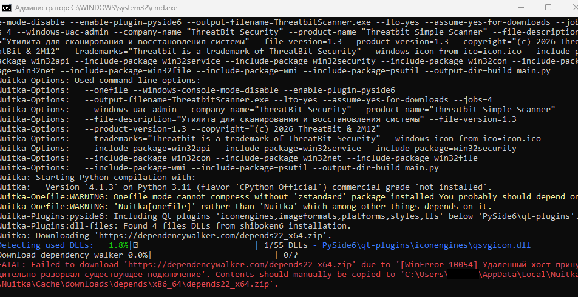

# Dependency Walker (Nuitka-совместимая версия)

**Depends** – портативная версия классического Dependency Walker, проверенная на совместимость с Nuitka-сборками.

## Зачем это нужно

При компиляции Python-скриптов через Nuitka могут возникать проблемы с отсутствующими DLL-зависимостями. Но с официального сайта не всегда получается скачать нужные зависимости нужной версии. Поэтому я и выкладываю актуальную версию под Nuitka.

<p align="center">
  
  <br><em>Пример ошибки компиляции</em>
</p>

> [!IMPORTANT]
>
> ### ❗ Важно
> Ознакомьтесь с [лицензией](https://github.com/2M12/depends-nuitka/blob/main/LICENSE) данного репозитория. Я не претендую на права depends22_x64.zip. Данный репозиторий создан исключительно для помощи. Все права сохраняются за правообладателем!

Этот архив содержит проверенную версию, которая:
- Работает с Nuitka-сборками (включая LTO)
- Не требует установки (портативная)
- Запускается на Windows 10/11
- Помогает найти недостающие DLL

## Куда его нужно установить (пошагово)
1. Перейдите по этому пути: **C:\Users\%username%\AppData\Local\Nuitka\Nuitka\Cache\downloads\depends\x86_64**
2. Скачайте архив с данного репозитория
3. Просто положите архив в папку x86_64 не распаковывая
4. Пробуйте заново компилировать ваш код через Nuitka

## Источники

- Официальный сайт: http://www.dependencywalker.com
- Wayback Machine: https://web.archive.org/web/*/dependencywalker.com

## ☑️ Hash-суммы
```bash
MD5	7975054e322794cd332d5f1c00eeec5f
SHA-256	35db68a613874a2e8c1422eb0ea7861f825fc71717d46dabf1f249ce9634b4f1
```
